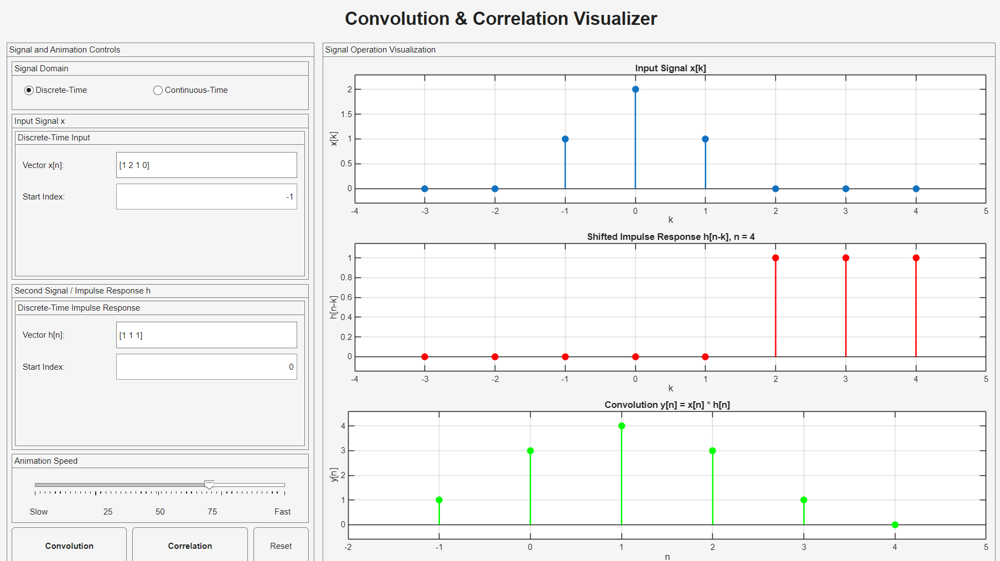
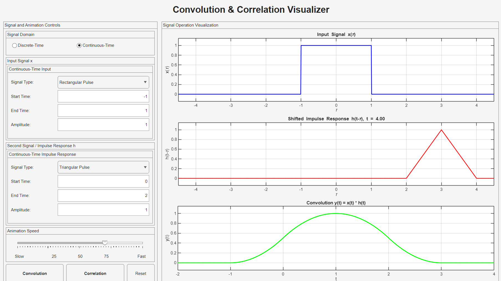

# Convolution & Correlation Visualizer using MATLAB — EEE 4602

An interactive **MATLAB GUI for visualizing convolution and correlation** in both discrete-time and continuous-time signal domains.

The application demonstrates the underlying signal operations through real-time animation, showing how one signal is transformed and swept across another while the resulting convolution or correlation is constructed progressively.

**Course:** EEE 4602  
**Project Type:** Signals and Systems GUI Project  
**Platform:** MATLAB  
**GUI Framework:** MATLAB App Designer / Programmatic App Components  
**Institution:** Islamic University of Technology (IUT)

---

## Overview

Convolution is a fundamental operation in Signals and Systems that describes the output of a Linear Time-Invariant (LTI) system in terms of an input signal and the system's impulse response.

Although the mathematical equations are straightforward, understanding the physical process of:

```text
Flip → Shift → Multiply → Sum / Integrate
```

can be difficult from equations alone.

This project was developed as an interactive educational tool that visualizes this process step-by-step.

The final application supports:

- Discrete-time convolution
- Continuous-time convolution
- Discrete-time correlation
- Continuous-time correlation
- Real-time animation
- Adjustable animation speed
- Custom signal inputs
- Multiple continuous-time signal types
- Input validation
- Reset functionality
- Progressive output visualization

---

# Final GUI

## Discrete-Time Interface

<p align="center">
  
</p>

In discrete-time mode, the user can specify:

- Input vector `x[n]`
- Starting index of `x[n]`
- Second signal `h[n]`
- Starting index of `h[n]`

The application then animates the selected signal operation.

---

## Continuous-Time Interface

<p align="center">
  
</p>

In continuous-time mode, users can construct signals by specifying:

- Signal type
- Start time
- End time
- Amplitude

The continuous-time signals are represented numerically using a small sampling interval and the corresponding integral operation is approximated computationally.

---

# Main Features

| Feature | Implementation |
|---|---|
| Discrete-time convolution | Supported |
| Continuous-time convolution | Supported |
| Discrete-time correlation | Supported |
| Continuous-time correlation | Supported |
| Custom discrete vectors | Supported |
| Custom starting indices | Supported |
| Continuous signal generator | Supported |
| Real-time animation | Supported |
| Adjustable animation speed | Supported |
| Reset control | Supported |
| Input validation | Supported |
| Error dialog | Supported |
| Dynamic plot limits | Supported |
| MATLAB `conv()` verification | Used for discrete convolution |

---

# Convolution

## Discrete-Time Convolution

For discrete-time signals:

```text
y[n] = Σ x[k] h[n-k]
```

The graphical process is:

```text
Original h[k]
     ↓
Time reversal
     ↓
h[-k]
     ↓
Shift by n
     ↓
h[n-k]
     ↓
Multiply with x[k]
     ↓
Sum overlapping samples
     ↓
y[n]
```

The application performs this process for every output index and animates the movement of the flipped second signal from left to right.

---

## Continuous-Time Convolution

For continuous-time signals:

```text
y(t) = ∫ x(τ) h(t-τ) dτ
```

The visualization follows:

```text
h(τ)
 ↓
Flip
 ↓
h(-τ)
 ↓
Shift
 ↓
h(t-τ)
 ↓
Multiply by x(τ)
 ↓
Numerically integrate
 ↓
y(t)
```

Since a computer cannot represent an infinite continuous-time signal directly, the application approximates the signals using sampled values.

The final implementation uses:

```text
dt = 0.01
```

for numerical integration.

---

# Correlation

Correlation measures the similarity between two signals as one is shifted relative to the other.

Unlike convolution, the signal being swept is **not time-reversed**.

The final GUI uses a left-to-right sweep convention.

---

## Discrete-Time Correlation

The implemented correlation convention is:

```text
r_xh[n] = Σ x[k] h[k-n]
```

The graphical sequence is:

```text
Original h[k]
     ↓
No Time Reversal
     ↓
Shift
     ↓
h[k-n]
     ↓
Multiply with x[k]
     ↓
Sum
     ↓
r_xh[n]
```

Therefore:

```text
Convolution → flipped + shifted
Correlation → shifted only
```

Both operations are animated from **left to right** for easier visual comparison.

---

## Continuous-Time Correlation

The implemented continuous-time correlation is:

```text
r_xh(t) = ∫ x(τ) h(τ-t) dτ
```

The second signal is shifted without time reversal:

```text
h(τ)
 ↓
Shift directly
 ↓
h(τ-t)
 ↓
Multiply by x(τ)
 ↓
Numerically integrate
 ↓
r_xh(t)
```

---

# Convolution vs Correlation

| Property | Convolution | Correlation |
|---|---|---|
| Signal reversal | Yes | No |
| Swept signal | `h[n-k]` / `h(t-τ)` | `h[k-n]` / `h(τ-t)` |
| Sweep direction in GUI | Left → Right | Left → Right |
| Main purpose | LTI system response | Signal similarity |
| Output | `y[n]` / `y(t)` | `r_xh[n]` / `r_xh(t)` |
| Commutative | Yes | Generally no |

The most visually important distinction is therefore:

```text
CONVOLUTION

h
↓
FLIP
↓
SWEEP
↓
Multiply
↓
Sum / Integrate
```

versus:

```text
CORRELATION

h
↓
NO FLIP
↓
SWEEP
↓
Multiply
↓
Sum / Integrate
```

---

# Visualization Layout

The GUI contains three synchronized plots.

## Plot 1 — Input Signal

Displays:

```text
x[k]
```

for discrete-time operation or:

```text
x(τ)
```

for continuous-time operation.

---

## Plot 2 — Swept Signal

During convolution:

```text
Discrete:   h[n-k]
Continuous: h(t-τ)
```

During correlation:

```text
Discrete:   h[k-n]
Continuous: h(τ-t)
```

The plot is updated continuously during the animation.

---

## Plot 3 — Result

During convolution:

```text
Convolution y[n]
```

or:

```text
Convolution y(t)
```

During correlation:

```text
Correlation r_xh[n]
```

or:

```text
Correlation r_xh(t)
```

The output is constructed progressively as the animation proceeds.

---

# Supported Continuous-Time Signals

The GUI can generate several standard signal types.

| Signal Type | Supported |
|---|---|
| Impulse | Yes |
| Step | Yes |
| Rectangular Pulse | Yes |
| Triangular Pulse | Yes |
| Sawtooth Pulse | Yes |

Each signal can be configured using the appropriate combination of:

```text
Amplitude
Start Time
End Time
```

For an impulse, the start time determines the impulse location.

---

# Discrete-Time Input

Discrete signals are entered manually as vectors.

Example:

```text
x[n] = [1 2 1 0]
```

with:

```text
Start Index = -1
```

and:

```text
h[n] = [1 1 1]
```

with:

```text
Start Index = 0
```

The software automatically calculates the corresponding output-index range.

---

# Animation Speed Control

The GUI includes an adjustable speed slider:

```text
Slow ←────────────→ Fast
```

The slider controls the delay between animation frames.

Internally, the program adjusts the total animation duration and calculates an appropriate delay for the number of frames being displayed.

This allows the operation to be viewed:

- slowly for detailed study;
- quickly for general visualization.

---

# Input Validation

The application validates user inputs before performing calculations.

Validation includes:

### Discrete-Time Mode

- Signal vectors cannot be empty.
- Vector elements must be numeric.
- Values must be finite.
- Starting indices must be integers.

### Continuous-Time Mode

- Start time must be finite.
- End time must be finite where applicable.
- End time must be greater than start time.
- Amplitude must be finite.

Invalid inputs generate a MATLAB GUI error dialog rather than causing the application to fail silently.

---

# Reset Function

The **Reset** button:

- stops any active animation;
- returns the application to discrete-time mode;
- restores default signals;
- restores default indices;
- restores default continuous-time parameters;
- resets the animation-speed slider;
- clears all plots;
- returns application status to `Ready`.

---

# Development Process

The repository preserves the evolution of the project rather than only the final GUI.

```text
Basic Convolution Mathematics
          ↓
convolution_validation.m
          ↓
Verify DT and CT calculations
          ↓
convolution_animation_prototype.m
          ↓
Add real-time signal movement
          ↓
Add GUI controls
          ↓
Add input validation
          ↓
Add speed control
          ↓
Add correlation
          ↓
Debug signal/index handling
          ↓
ConvolutionAnimationApp.m
          ↓
Final Interactive Visualizer
```

---

# Development Stage 1 — Convolution Validation

The first development script is:

[`MATLAB/Development/convolution_validation.m`](MATLAB/Development/convolution_validation.m)

Its purpose was to verify that the basic convolution calculations produced the expected outputs before implementing animation or GUI components.

It contains examples of both:

```text
Discrete-Time Convolution
Continuous-Time Convolution
```

MATLAB's built-in:

```matlab
conv()
```

function is used as a numerical reference.

For continuous-time convolution:

```matlab
conv(x, h) * dt
```

is used to approximate the convolution integral.

---

# Development Stage 2 — Animation Prototype

The next development stage is:

[`MATLAB/Development/convolution_animation_prototype.m`](MATLAB/Development/convolution_animation_prototype.m)

This stage introduced the real-time visualization concept.

Instead of displaying only the final result, the second signal is progressively shifted while the resulting output is constructed.

This prototype formed the basis for the animation logic later integrated into the GUI.

---

# Final Application

The complete application is:

[`MATLAB/Final_App/ConvolutionAnimationApp.m`](MATLAB/Final_App/ConvolutionAnimationApp.m)

This file contains:

- GUI construction
- mode selection
- convolution callbacks
- correlation callbacks
- animation logic
- discrete signal parsing
- continuous signal generation
- input validation
- dynamic axis scaling
- reset functionality
- animation-speed control
- error handling

The application is implemented as:

```matlab
classdef ConvolutionAnimationApp < matlab.apps.AppBase
```

---

# Running the Application

## Requirements

You need:

```text
MATLAB
```

with support for MATLAB App/UI components such as:

```text
uifigure
uiaxes
uigridlayout
uipanel
uibutton
uidropdown
uislider
```

---

## Method 1 — Run from MATLAB

Navigate to:

```text
MATLAB/Final_App/
```

and execute:

```matlab
app = ConvolutionAnimationApp;
```

---

## Method 2 — Open the Source File

Open:

```text
MATLAB/Final_App/ConvolutionAnimationApp.m
```

in MATLAB and run the class.

---

# Using the GUI

## Discrete-Time Mode

1. Select:

```text
Discrete-Time
```

2. Enter:

```text
x[n]
```

and its starting index.

3. Enter:

```text
h[n]
```

and its starting index.

4. Select either:

```text
Convolution
```

or:

```text
Correlation
```

5. Adjust animation speed if required.

6. Observe the three synchronized plots.

---

## Continuous-Time Mode

1. Select:

```text
Continuous-Time
```

2. Select the input-signal type.

3. Configure:

```text
Amplitude
Start Time
End Time
```

4. Configure the second signal.

5. Select:

```text
Convolution
```

or:

```text
Correlation
```

6. Observe the signal transformation and resulting operation.

---

# Numerical Implementation

## Continuous-Time Approximation

Continuous-time operations require numerical approximation.

The GUI uses:

```text
dt = 0.01
```

and evaluates the integral approximately as:

```text
Σ product × dt
```

For convolution:

```text
y(t) ≈ Σ x(τ)h(t-τ) dt
```

For correlation:

```text
r_xh(t) ≈ Σ x(τ)h(τ-t) dt
```

A smaller `dt` produces a finer approximation at the expense of additional computation.

---

# Discrete Convolution Verification

The animated discrete-time convolution result is checked against MATLAB's built-in:

```matlab
conv(x,h)
```

using a small numerical tolerance.

This provides an additional correctness check between the educational animation algorithm and MATLAB's reference implementation.

---

# Repository Structure

```text
Convolution-Correlation-Visualizer-MATLAB-EEE4602/
│
├── README.md
│
├── Docs/
│   ├── EEE4602_Convolution_GUI_Project_Manual.pdf
│   └── EEE4602_Convolution_GUI_Project_Report.pdf
│
├── Figures/
│   ├── continuous_time_gui.png
│   └── discrete_time_gui.png
│
├── MATLAB/
│   ├── Development/
│   │   ├── convolution_animation_prototype.m
│   │   └── convolution_validation.m
│   │
│   └── Final_App/
│       └── ConvolutionAnimationApp.m
│
└── Presentation/
    └── EEE4602_Convolution_Visualizer_Presentation.pptx
```

---

# Documentation

## Project Manual

The original project specification is available at:

[`Docs/EEE4602_Convolution_GUI_Project_Manual.pdf`](Docs/EEE4602_Convolution_GUI_Project_Manual.pdf)

The project required development of a graphical visualization tool for convolution involving both discrete-time and continuous-time signals.

---

## Project Report

The complete submitted project report is available at:

[`Docs/EEE4602_Convolution_GUI_Project_Report.pdf`](Docs/EEE4602_Convolution_GUI_Project_Report.pdf)

The report discusses:

- convolution theory;
- discrete-time signals;
- continuous-time signals;
- MATLAB implementation;
- GUI development;
- animation;
- correlation;
- animation-speed control;
- input validation;
- debugging;
- project methodology;
- team contributions.

---

## Presentation

The project presentation is available at:

[`Presentation/EEE4602_Convolution_Correlation_Visualizer_Presentation.pptx`](Presentation/EEE4602_Convolution_Correlation_Visualizer_Presentation.pptx)

---

# Tools and Technologies

- MATLAB
- MATLAB App Designer concepts
- MATLAB AppBase
- MATLAB UI Components
- Discrete-Time Signal Processing
- Continuous-Time Signal Approximation
- Numerical Integration
- Convolution
- Correlation
- Signal Visualization
- Animated Plotting
- GUI Development

---

# Engineering Concepts Applied

The project applies several concepts from Signals and Systems:

- Linear Time-Invariant systems
- Impulse response
- Discrete-time convolution
- Continuous-time convolution
- Cross-correlation
- Signal reversal
- Signal shifting
- Signal overlap
- Numerical integration
- Sampling
- Signal support
- Input/output relationships
- Discrete indexing
- Signal visualization

---

# Team

The project was completed by:

- **Ar-Rafi Ishraq**
- **Tanjim Mahbub**
- **Adhnan Kalim**
- **Ashfiq Ul Rahman**

---

# My Contributions

According to the submitted project report, **Ar-Rafi Ishraq** contributed to:

- Code writing
- Debugging
- Report writing

The project was developed collaboratively, with other team members contributing to correlation implementation, animation, GUI design, documentation, and debugging.

---

# Key Learning Outcomes

The project provided practical experience with:

- translating mathematical equations into algorithms;
- implementing discrete-time convolution;
- approximating continuous-time convolution numerically;
- visualizing signal transformations;
- implementing animated plots;
- developing interactive MATLAB interfaces;
- validating user inputs;
- debugging indexing and signal-support problems;
- comparing convolution and correlation;
- designing engineering software for educational use.

---

# Current Limitations

The application currently has several limitations:

- Continuous-time signals are numerical approximations rather than symbolic functions.
- Continuous-time resolution is fixed at `dt = 0.01`.
- Only predefined continuous-time signal shapes are available.
- No arbitrary mathematical-expression parser is implemented.
- Complex-valued signal correlation is not explicitly handled using complex conjugation.
- No standalone compiled application is provided.
- No automatic export of plots or results is implemented.
- Very long signals can increase animation time.

---

# Possible Future Improvements

Potential improvements include:

- User-adjustable sampling interval
- Arbitrary function input
- Sinusoidal signal support
- Exponential signal support
- Complex-valued signals
- Complex-conjugate correlation
- Pause/resume animation
- Frame-by-frame stepping
- Automatic plot export
- Result-data export
- MATLAB App packaging
- Standalone executable creation
- Additional signal-operation visualizations
- Autocorrelation mode
- Fourier transform visualization

---

# Academic Context

This project was completed for:

**EEE 4602**

Department of Electrical and Electronic Engineering  
Islamic University of Technology (IUT)

The project focused on using computational visualization to develop a clearer understanding of convolution and correlation in Signals and Systems.

---

# Repository Maintainer

**Ar-Rafi Ishraq**  
Electrical and Electronic Engineering
